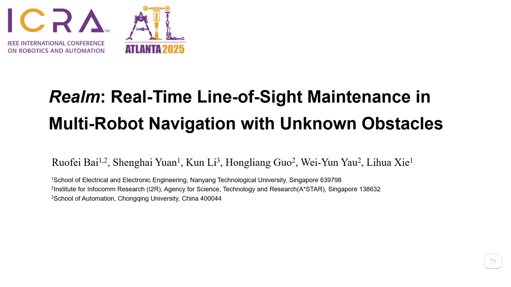

<!--  -->
<h3> ICRA 2025: Realm: Real-time Line-of-Sight Maintenance in Multi-Robot Navigation with Unknown Obstacles </h3>

Ruofei Bai1,2, Shenghai Yuan1, Kun Li3, Hongliang Guo4, Wei-Yun Yau2, Lihua Xie1

1 Nanyang Technological University,
2 Institute for Infocomm Research (I2R), Agency for Science, Technology and Research (A*STAR)
3 School of Automation, Chongqing University
4 College of Computer Science, Sichuan University

<!--  -->

<!-- 

 -->

## News

- Our paper has been selected as a **Best Paper Award Finalist of ICRA 2025**!

> Due to another ongoing work, we will organize the code and release the source code in **August 2025**. If you have any request or issues, feel free to open an issue. 

## Demo Video

Short video to intorduce our work:

Please wait for the simulation gif to load...

